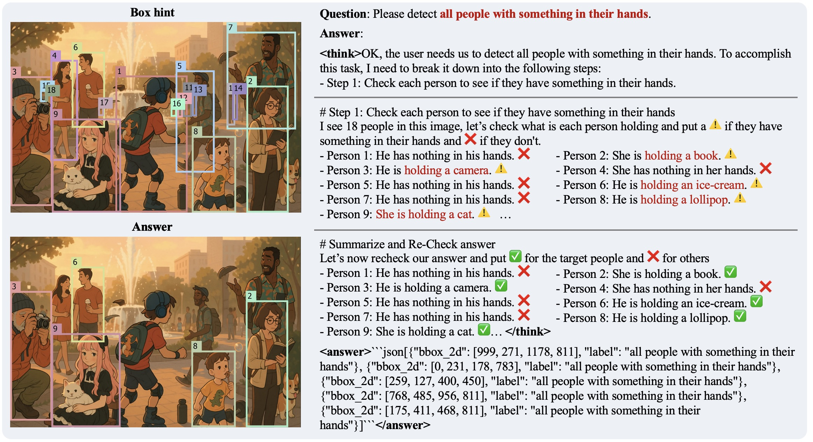
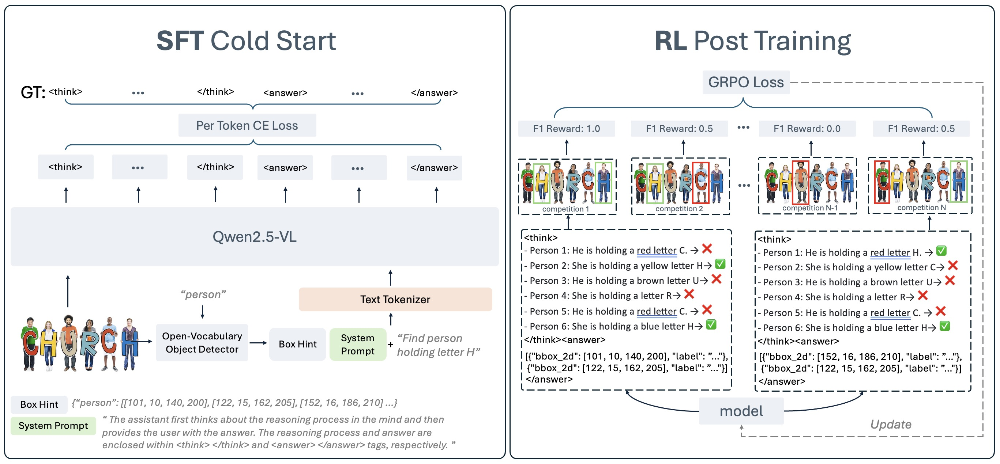
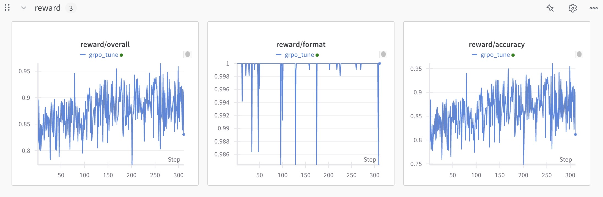
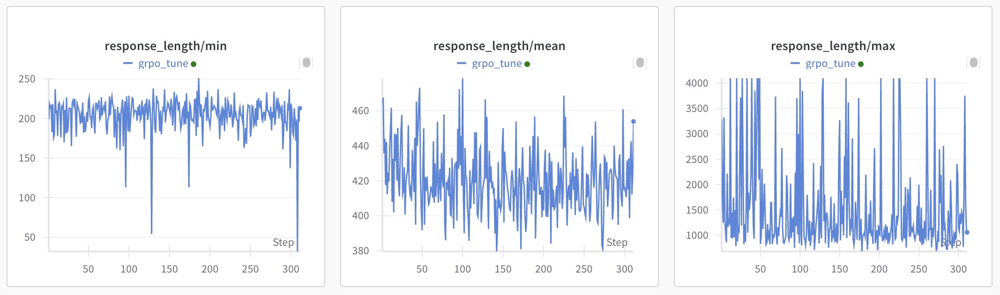
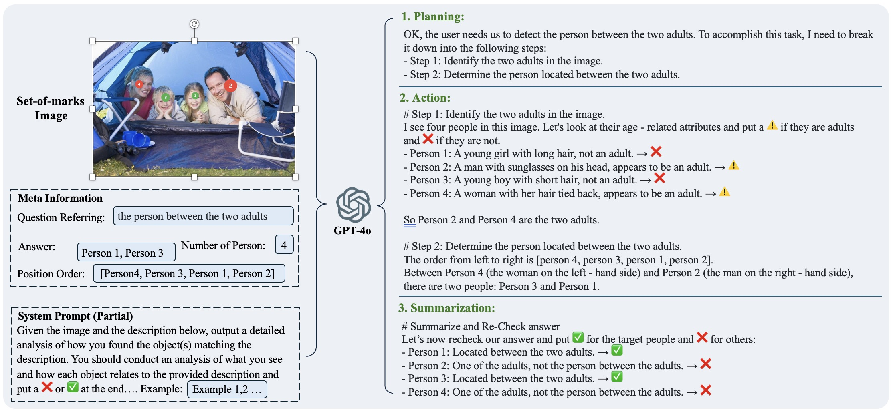

<div align=center>
  
</div>

# 🦖🧠 Rex-Thinker: Grounded Object Refering via Chain-of-Thought Reasoning 🦖🧠

<div align=center>

<p align="center">
  <a href="https://rexthinker.github.io/">
    
  </a>
  <a href="https://arxiv.org/abs/2506.04034">
    
  </a>
  <a href="https://huggingface.co/IDEA-Research/Rex-Thinker-GRPO-7B">
    
  </a>
  <a href="https://huggingface.co/datasets/IDEA-Research/HumanRef-CoT-45k">
    
  </a>
  <a href="https://huggingface.co/spaces/Mountchicken/Rex-Thinker-Demo">
    
  </a>
  
</p>

</div>

> We propose Rex-Thinker, a Chain-of-Thought (CoT) reasoning model for object referring that addresses two key challenges: lack of interpretability and inability to reject unmatched expressions. Instead of directly predicting bounding boxes, Rex-Thinker reasons step-by-step over candidate objects to determine which, if any, match a given expression. Rex-Thinker is trained in two stages: supervised fine-tuning to learn structured CoT reasoning, followed by reinforcement learning with GRPO to enhance accuracy, faithfulness, and generalization. Our approach improves both prediction precision and interpretability, while enabling the model to abstain when no suitable object is found. Below is an example of the model's reasoning process:

<p align="center"></p>


## Method

**Rex-Thinker** reformulates object referring as a **Chain-of-Thought (CoT)** reasoning task to improve both interpretability and reliability. The model follows a structured three-stage reasoning paradigm:

1. **Planning**: Decompose the referring expression into interpretable subgoals.

2. **Action**: Evaluate each candidate object (obtained via an open-vocabulary detector) against these subgoals using step-by-step reasoning.

3. **Summarization**: Aggregate the intermediate results to output the final prediction — or abstain when no object matches.

Each reasoning step is grounded in a specific candidate object region through **Box Hints**, making the process transparent and verifiable.

Rex-Thinker is implemented on top of **QwenVL-2.5**, and trained in two stages:

- **Supervised Fine-Tuning (SFT)**  
  Cold-start training using GPT-4o-generated CoT traces as supervision.

- **GRPO-based Reinforcement Learning**  
  Further optimizes reasoning accuracy, generalization, and rejection ability via Group Relative Policy Optimization.

This CoT-based framework enables Rex-Thinker to make faithful, interpretable predictions while generalizing well to out-of-domain referring scenarios.


<p align="center"></p>


# Table of Contents

- [Method](#method)
- [1. Installation ⛳️](#1-installation-️)
  - [1.1 Download Pre-trained Model](#11-download-pre-trained-model)
- [2. Inference 🚀](#2-inference-)
- [3. Gradio Demo 🤗](#3-gradio-demo-)
- [4. GRPO Post Training ⚙️](#4-grpo-post-training-️)
  - [4.1 Prepare dataset for GRPO training](#41-prepare-dataset-for-grpo-training)
  - [4.2 Start Training](#42-start-training)
- [5. Evaluation on HumanRef Benchmark 🌋](#5-evaluation-on-humanref-benchmark-)
- [6. HumanRef-CoT Dataset 📊](#6-humanref-cot-dataset-)
  - [6.1 Visualize the dataset](#61-visualize-the-dataset)
- [7. Website 🌐](#7-website-)
- [8. Acknowledgements 🙏](#8-acknowledgements-)
- [9. LICENSE](#9-license)
- [Citation 📜](#citation-)


## 1. Installation ⛳️

```bash
conda create -n rexthinker -m python=3.10
pip install torch==2.6.0 torchvision==0.21.0 --index-url https://download.pytorch.org/whl/cu124
pip install -v -e .

# additional packages Grounding DINO
git clone https://github.com/IDEA-Research/GroundingDINO.git
cd GroundingDINO
##  To support torch2.6
git remote add quantumope https://github.com/QuantuMope/GroundingDINO.git
git fetch quantumope PR/andrew/add-torch26-support-ms-deform-attn
git merge quantumope/PR/andrew/add-torch26-support-ms-deform-attn
##  Continue with installation
pip install -v -e .
mkdir weights
wget -q https://github.com/IDEA-Research/GroundingDINO/releases/download/v0.1.0-alpha/groundingdino_swint_ogc.pth -P weights
cd ..
```

### 1.1 Download Pre-trained Model
We provide the pre-trained model weights of Rex-Thinker-GRPO, which is trained on HumanRef-CoT through SFT and GRPO. You can download the model weights from [Hugging Face](https://huggingface.co/IDEA-Research/Rex-Thinker-GRPO-7B).

Or you can also using the following command to download the pre-trained models:
```bash
git lfs install
git clone https://huggingface.co/IDEA-Research/Rex-Thinker-GRPO-7B IDEA-Research/Rex-Thinker-GRPO-7B
```

## 2. Inference 🚀
We provide a simple inference script to test the model. In this script, we use Grouning DINO to get the candidate boxes.  You can run the following command to test the model:

```bash
CUDA_VISIBLE_DEVICES=0 python demo/inference_single_image.py \
  --image_path demo/example_images/demo_helmet.png \
  --cate_name helmet \
  --ref_exp the forth helmet from left \
  --vis_path vis/example_output.jpg 
```

You will get output fromt the terminal like this:
```text
<think>OK, the user needs us to detect the fourth helmet from left. To accomplish this task, I need to break it down into the following steps:
- Step 1: Sort the helmets from left to right.
- Step 2: Find the fourth helmet from the sorted list.

# Step 1: Sort the helmets from left to right
I see 6 helmets in this image, and their order from left to right is [Helmet 5, Helmet 1, Helmet 3, Helmet 2, Helmet 4, Helmet 6].

# Step 2: Find the fourth helmet from the sorted list
From the sorted list [Helmet 5, Helmet 1, Helmet 3, Helmet 2, Helmet 4, Helmet 6], the fourth helmet from the left is Helmet 2.

# Summarize and Re-Check answer
Let's now recheck our answer and put ✅ for the target helmet and ❌ for others
- Helmet 5: It is the first helmet from left → ❌
- Helmet 1: It is the second helmet from left → ❌
- Helmet 3: It is the third helmet from left → ❌
- Helmet 2: It is the fourth helmet from left → ✅
- Helmet 4: It is the fifth helmet from left → ❌
- Helmet 6: It is the sixth helmet from left → ❌</think><answer>json
[{"bbox_2d": [578, 359, 825, 580], "label": "the forth helmet from left"}]
</answer>
```

and visulized results like this:
<p align="center"></p>


## 3. Gradio Demo 🤗
We provide a Gradio demo for you to test the model. You can run the following command to start the Gradio demo:
```bash
CUDA_VISIBLE_DEVICES=0 python demo/gradio_demo.py \
  --model_path IDEA-Research/Rex-Thinker-GRPO-7B \
  --server_ip 0.0.0.0 \
  --server_port 7860
```

Then you can open your browser and visit `http://localhost:7860` to see the Gradio demo. You can input the image path, category name, and referring expression to test the model.

<p align="center"></p>


## 4. GRPO Post Training ⚙️
With the weights of our Rex-Thinker model as a starting point—a model equipped with Chain-of-Thought (CoT) reasoning for referring tasks—you can also fine-tune it to your own domain using the GRPO algorithm. We provide an example code to show you how to fine-tune it on RefCOCOg dataset.


### 4.1 Prepare dataset for GRPO training
- Step1: Download our pre-processed RefCOCOg dataset at [Hugging Face](https://huggingface.co/datasets/Mountchicken/RefCOCOg-RexThinker-20k). This dataset if splited from the training set of RefCOCOg, with 20k samples.
- We also provide a detailed [README](rexthinker/tools/dataset_tools/README.md) to show you how to prepare your own customized dataset for GRPO training.

### 4.2 Start Training
We use [EasyR1](https://github.com/hiyouga/EasyR1) for GRPO training, thanks for their great work. You can run the following command to start training:

```bash
bash rexthinker/scripts/grpo_tune_refcocog.sh
```

Parameter explanation:
- `config`: The config file for GRPO training. You can find the config files in `rexthinker/scripts/config.yaml`.
- `data.train_files`: The path to the training dataset.
- `worker.actor.model.model_path`: The path to the pre-trained model weights of Rex-Thinker-GRPO
- `worker.actor.global_batch_size, data.rollout_batch_size=64, micro_batch_size_per_device_for_update, micro_batch_size_per_device_for_experience`: See [Here](https://github.com/hiyouga/EasyR1?tab=readme-ov-file#how-to-understand-grpo-in-easyr1) for explanation.

#### Training Logs
Here is the training logs of fine-tuning Rex-Thinker on RefCOCOg dataset through GRPO.
<p align="center"></p>

<p align="center"></p>

### 4.3 Convert to Hugging Face Format
```bash
python tools/convert_easy_r1_ckpt_to_hugginface.py \
  --local_dir work_dirs/rexthinker/qwen25vl_7b_grpo_on_refcocog/global_step_312/actor
```

## 5. Evaluation on HumanRef Benchmark 🌋
We also provide the evaluation code for [HumanRef benchmark](https://github.com/IDEA-Research/RexSeek?tab=readme-ov-file#51-download). You can run the following command to evaluate the model on HumanRef dataset:

```bash
bash evaluation/submit.sh
```

To know more about the metric, please refer to this [Doc](https://github.com/IDEA-Research/RexSeek?tab=readme-ov-file#531-metrics)


## 6. HumanRef-CoT Dataset 📊
To support Chain-of-Thought (CoT) reasoning in referring expression comprehension, we introduce HumanRef-CoT, a large-scale dataset with 90,824 high-quality step-by-step reasoning annotations. Built on the HumanRef dataset, which focuses on multi-person referring tasks, HumanRef-CoT provides structured CoT traces—including planning, action, and summarization—generated using GPT-4o. These annotations make the model's reasoning process interpretable and verifiable, and serve as training data for both supervised fine-tuning and GRPO-based instruction tuning.

<p align="center"></p>

We open source a subset of HumanRef-CoT with 45k samples for academic research. You can download the dataset from [Hugging Face](https://huggingface.co/datasets/IDEA-Research/HumanRef-CoT-45K). The dataset is in tsv format. which you can use the following script for visualize

### 6.1 Visualize the dataset

```bash
python tools/visualize_humanref_cot.py \
  --img_tsv data/IDEA-Research/HumanRef-CoT-45k/humanref_cot.images.tsv \
  --ann_tsv data/IDEA-Research/HumanRef-CoT-45k/humanref_cot.annotations.tsv \
  --ann_lineidx data/IDEA-Research/HumanRef-CoT-45k/humanref_cot.annotations.tsv.lineidx \
  --num_vis 50 \
  --output_dir vis/humanref_cot
```

Note that the current visualization code can't draw emoji ✅, ❌, and ⚠️, which are used in the dataset. 


## 7. Website 🌐
We build our cool website using Claude4-sonnet. Check the source code here [rexthinker.github.io](https://github.com/rexthinker/rexthinker.github.io). This website is under MIT license, so you can use it for your own project.

## 8. Acknowledgements 🙏
We would like to thank the following projects for their contributions to this work:
- [Grounding DINO](https://github.com/IDEA-Research/GroundingDINO)
- [EasyR1](https://github.com/hiyouga/EasyR1)


## 9. LICENSE
Rex-Thinker is licensed under the [IDEA License 1.0](LICENSE), Copyright (c) IDEA. All Rights Reserved.


## Citation 📜
```text
@misc{jiang2025rexthinkergroundedobjectreferring,
      title={Rex-Thinker: Grounded Object Referring via Chain-of-Thought Reasoning}, 
      author={Qing Jiang and Xingyu Chen and Zhaoyang Zeng and Junzhi Yu and Lei Zhang},
      year={2025},
      eprint={2506.04034},
      archivePrefix={arXiv},
      primaryClass={cs.CV},
      url={https://arxiv.org/abs/2506.04034}, 
}
```