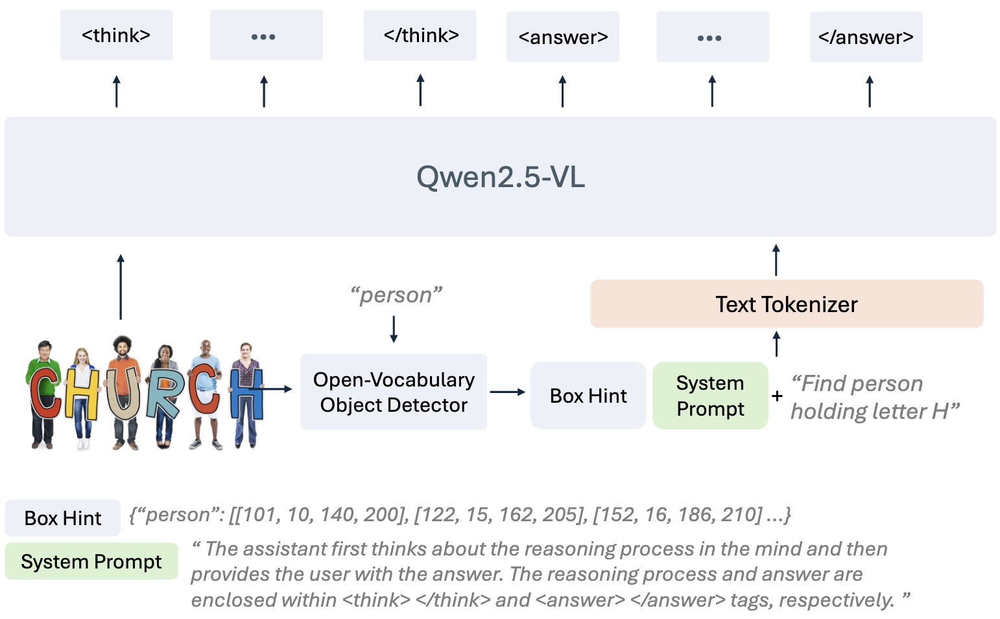

# Prepare Custom Dataset for Rex-Thinker-GRPO Training
In this tutorial, we will show how to prepare a custom dataset for Rex-Thinker-GRPO training. 

## How Does Rex-Thinker work?
Before we start, we need to know how Rex-Thinker works so that we can know what kind of data we need to prepare.

Rex-Thinker is a model designed for referring expression comprehension tasks. It takes three main components as input:

1. **System Prompt**: A predefined prompt that guides the model's behavior and reasoning process.

2. **Referring Question**: A natural language expression that describes the target object in the image. For example, "the person wearing a red shirt" or "two turkeys near a tree".

3. **Box Hint**: A set of bounding boxes that represent all instances of the referred object category in the image. For instance, if the referring expression is "the person wearing a red shirt", the box hints would include bounding boxes for all people in the image. These hints serve two important purposes:
   - Guide the model's grounded reasoning process by providing relevant object locations
   - Reduce the difficulty of direct coordinate prediction by giving reference points

<div align=center>
  
</div>

Next, we will guide you through a two step process to prepare a custom dataset for Rex-Thinker-GRPO training.

## Step 1. Add Candidate boxes by Grounding DINO 

A standard data format we need is a json file with a list of dicts. Each dict contains the following keys:
```python
{
    "image_name": "COCO_train2014_000000292799.jpg",
    "ans": [82.92, 201.37, 479.07, 586.99],
    "referring": "two turkeys near a tree",
    "category": "turkey"
    "candidate_boxes": [
        {
            "bbox": [82.92, 201.37, 479.07, 586.99],
            "category": "turkey"
        },
        {
            "bbox": [233.32, 164.58, 357.44, 344.42],
            "category": "turkey"
        },
        {
            "bbox": [233.58, 164.63, 451.35, 357.78],
            "category": "turkey"
        },
        {
            "bbox": [116.42, 212.40, 430.18, 536.94],
            "category": "turkey"
        }
    ]
}
```
where
- `image_name`: The name of the image file.
- `ans`: The ground truth bounding box coordinates [x0, y0, x1, y1] for the target object.
- `referring`: The referring expression that describes the target object.
- `category`: The category of the target object.
- `candidate_boxes`: A list of bounding boxes for all instances of the referred object category in the image. Each dict contains the following keys:
    - `bbox`: The bounding box coordinates [x0, y0, x1, y1]. **Be sure that your ans box is in the candidate boxes.**
    - `category`: The category of the bounding box.
    
If you have a dataset with the above format, you can skip this step. If not, you can use the following code to generate the candidate boxes using Grounding DINO.

First prepare dataset in a similar format as above, but without the `candidate_boxes` key. You can use the following code to generate the candidate boxes using Grounding DINO.

### Install Grounding DINO

```bash
git clone https://github.com/IDEA-Research/GroundingDINO.git
cd GroundingDINO
# To support torch2.6
git remote add quantumope https://github.com/QuantuMope/GroundingDINO.git
git fetch quantumope PR/andrew/add-torch26-support-ms-deform-attn
git merge quantumope/PR/andrew/add-torch26-support-ms-deform-attn
# Continue with installation
pip install -v -e .
mkdir weights
wget -q https://github.com/IDEA-Research/GroundingDINO/releases/download/v0.1.0-alpha/groundingdino_swint_ogc.pth -P weights
cd ..
```

### Generate Candidate Boxes
```bash
python rexthinker/tools/dataset_tools/add_candidates_by_grounding_dino.py \
    --anno_path /path/to/your/input.json \
    --image_root /path/to/your/image_root \
    --save_path /path/to/your/output.json
```

## Step 2. Convert json dataset to Huggingface Parquet format
We are using Easy-R1 for our GRPO training. In this code base, we need to convert the json dataset to Huggingface Parquet format. You can use the following code to convert the json annotation from step 1 to Huggingface Parquet format.

```bash
python rexthinker/tools/dataset_tools/convert_dataset.py \
    --anno_path /path/to/your/input.json \
    --image_root /path/to/your/image_root \
    --save_path /path/to/your/output.parquet
```

## 3. Toy Example
We have prepared a toy dataset to help you get started. You can find the dataset in the `grpo_training/tools/dataset_tools/toy_dataset` directory. The dataset is in the same format as described in step 1, but without candidate boxes.

- Step1: Add candidate boxes
    ```bash
    python rexthinker/tools/dataset_tools/add_candidates_by_grounding_dino.py \
        --anno_path rexthinker/tools/dataset_tools/toy_dataset/anno.json \
        --image_root rexthinker/tools/dataset_tools/toy_dataset/images \
        --save_path rexthinker/tools/dataset_tools/toy_dataset/anno_with_candidates.json
    ```

    > if you have this error: OSError: We couldn't connect to 'https://huggingface.co' to load the files
    > try:

    ```bash
    HF_ENDPOINT=https://hf-mirror.com python rexthinker/tools/dataset_tools/add_candidates_by_grounding_dino.py \
        --anno_path rexthinker/tools/dataset_tools/toy_dataset/anno.json \
        --image_root rexthinker/tools/dataset_tools/toy_dataset/images \
        --save_path rexthinker/tools/dataset_tools/toy_dataset/anno_with_candidates.json
    ```

- Step2: Convert to parquet
    ```bash
    python rexthinker/tools/dataset_tools/convert_dataset.py \
        --anno_path rexthinker/tools/dataset_tools/toy_dataset/anno_with_candidates.json \
        --image_root rexthinker/tools/dataset_tools/toy_dataset/images \
        --save_path rexthinker/tools/dataset_tools/toy_dataset/anno_with_candidates.parquet
    ```